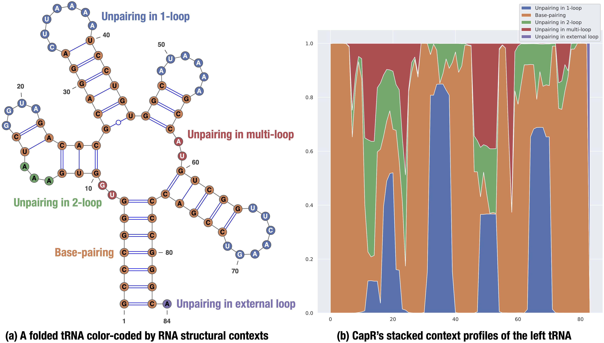
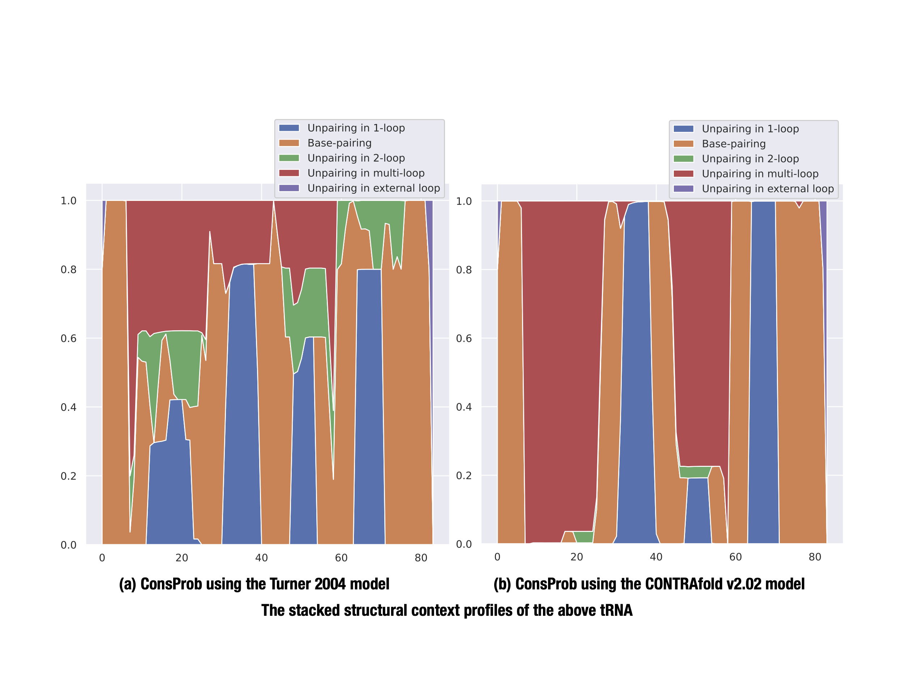

# Quick Probability Inference Engine on RNA Structural Alignment
# Installation
This project is written in Rust, a systems programming language.
You need to install Rust components, i.e., rustc (the Rust compiler), cargo (the Rust package manager), and the Rust standard library.
Visit [the Rust website](https://www.rust-lang.org) to see more about Rust.
You can install Rust components with the following one line:
```bash
$ curl --proto '=https' --tlsv1.2 -sSf https://sh.rustup.rs | sh
```
[Rustup](https://github.com/rust-lang-nursery/rustup.rs) arranges the above installation and enables to switch a compiler in use easily.
You can install ConsProb:
```bash
$ # AVX, SSE, and MMX enabled for rustc (another example: RUSTFLAGS='--emit asm -C target-feature=+avx2 -C target-feature=+ssse3 -C target-feature=+mmx -C target-feature=+fma')
$ RUSTFLAGS='--emit asm -C target-feature=+avx -C target-feature=+ssse3 -C target-feature=+mmx' cargo install consprob
```
Check if you have installed ConsProb properly:
```bash
$ consprob # Its available command options will be displayed
```
You can run ConsProb with a prepared test set of sampled tRNAs:
```bash
$ git clone https://github.com/heartsh/consprob && cd consprob
$ cargo test --release -- --nocapture
```

# Structural Alignment Scoring Model
While ConsProb's paper describes only [the Turner 2004 model](https://rna.urmc.rochester.edu/NNDB/) as an available scoring model of RNA structural alignment, ConsProb also offers [the CONTRAfold v2.02 model](http://contra.stanford.edu/contrafold/).
These two scoring models are described [here](https://github.com/heartsh/rna-ss-params).
One of the CONTRAfold v2.02 model's advantages over the Turner 2004 model is considering noncanonical nucleotide base-pairings.
My prediction accuracy benchmarking of [ConsAlifold](https://github.com/heartsh/consalifold) adopting ConsProb did not show the significant difference between the CONTRAfold v2.02 model and the Turner 2004 model:

|
|:-:|

In my running time benchmarking of ConsAlifold adopting ConsProb, the CONTRAfold v2.02 model was significantly slower than the Turner 2004 model due to the larger spaces of possible RNA structural alignments:

|
|:-:|


# Advanced Computation of RNA Structural Context Profiles
Measuring the structural context profile of each RNA nucleotide (i.e., the posterior probability that each nucleotide is in each structural context type) is beneficial to various structural analyses around functional non-coding RNAs.
For example, [CapR](https://github.com/fukunagatsu/CapR) computes RNA structural context profiles on RNA secondary structures, distinguishing (1) unpairing in hairpin loops, (2) base-pairings, (3) unpairing in 2-loops (e.g., bulge loops and interior loops), (4) unpairing in multi-loops, and (5) unpairing in external loops as available structural context types:

|
|:-:|

Respecting CapR, ConsProb offers the computation of average structural context profiles on RNA structural alignment, distinguishing the above structural context types.
Technically, ConsProb calculates the structural context profile of each nucleotide pair on RNA pairwise structural alignment and averages this pairwise context profile over available RNA homologs to each RNA homolog, marginalizing these available RNA homologs.
ConsProb's context profile computation is available for the Turner 2004 model and the CONTRAfold v2.02 model but is not described in ConsProb's paper. (You can easily derive this context profile computation by customizing ConsProb's main inside-outside algorithm for computing posterior nucleotide pair-matching probabilities, as CapR is based on McCaskill's algorithm.)
The below is examples of ConsProb's average context profiles:

|
|:-:|


# Author
[Heartsh](https://github.com/heartsh)

# License
Copyright (c) 2018 Heartsh  
Licensed under [the MIT license](http://opensource.org/licenses/MIT).
