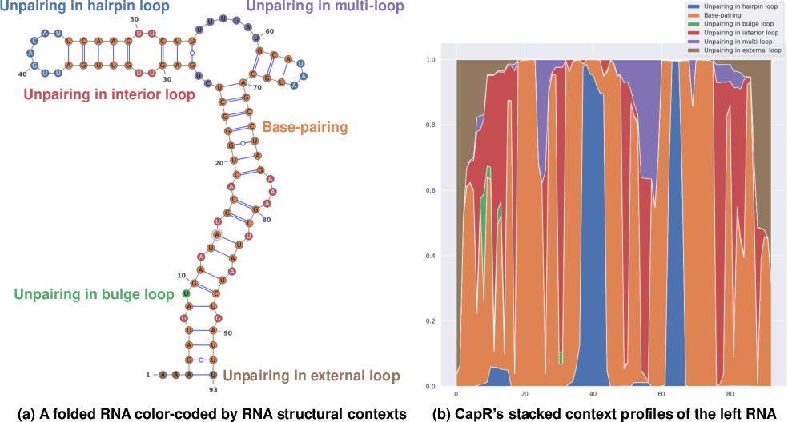
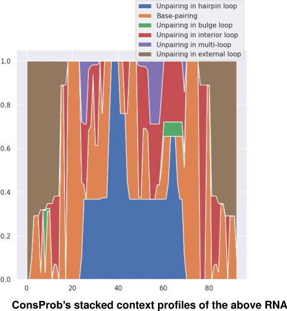

# Quick Probability Inference Engine on RNA Structural Alignment
# Installation
This project is written in Rust, a systems programming language.
You need to install Rust components, i.e., rustc (the Rust compiler), cargo (the Rust package manager), and the Rust standard library.
Visit [the Rust website](https://www.rust-lang.org) to see more about Rust.
You can install Rust components with the following one line:
```bash
curl --proto '=https' --tlsv1.2 -sSf https://sh.rustup.rs | sh
```
[Rustup](https://github.com/rust-lang-nursery/rustup.rs) arranges the above installation and enables to switch a compiler in use easily.
You can install ConsProb:
```bash
# AVX, SSE, and MMX enabled for rustc
# Another example: RUSTFLAGS='--emit asm -C target-feature=+avx2 -C target-feature=+ssse3 -C target-feature=+mmx -C target-feature=+fma'
RUSTFLAGS='--emit asm -C target-feature=+avx -C target-feature=+ssse3 -C target-feature=+mmx' \
  cargo install consprob
```
Check if you have installed ConsProb properly:
```bash
# Its available command options will be displayed
consprob
```
You can run ConsProb with a prepared test set of sampled tRNAs:
```bash
git clone https://github.com/heartsh/consprob \
  && cd consprob
cargo test --release
# The below command requires Gnuplot (http://www.gnuplot.info)
# Benchmark results will be found at "./target/criterion/report/index.html"
cargo bench
```

# Advanced Computation of RNA Structural Context Profiles
Measuring the structural context profile of each RNA nucleotide (i.e., the posterior probability that each nucleotide is in each structural context type) is beneficial to various structural analyses around functional non-coding RNAs.
For example, [CapR](https://github.com/fukunagatsu/CapR) computes RNA structural context profiles on RNA secondary structures, distinguishing (1) unpairing in hairpin loops, (2) base-pairings, (3) unpairing in bulge loops, (4) unpairing in interior loops, (5) unpairing in multi-loops, and (6) unpairing in external loops as available structural context types:

|
|:-:|

Respecting CapR, ConsProb offers the computation of average structural context profiles on RNA structural alignment, distinguishing the above structural context types.
Technically, ConsProb calculates the structural context profile of each nucleotide pair on RNA pairwise structural alignment and averages this pairwise context profile over available RNA homologs to each RNA homolog, marginalizing these available RNA homologs.
ConsProb's context profile computation is not described in ConsProb's paper.
However, you can easily derive this context profile computation by customizing ConsProb's main inside-outside algorithm for computing posterior nucleotide pair-matching probabilities, as CapR is based on McCaskill's algorithm.
The below is examples of ConsProb's average context profiles:

|
|:-:|

# Docker Playground 
I offer [my Docker-based playground for RNA software and its instruction](https://github.com/heartsh/rna-playground) to replay my computational experiments easily.

# Method Digest
[LocARNA-P](https://github.com/s-will/LocARNA) can compute posterior nucleotide pair-matching probabilities on RNA pairwise structural alignment.
However, LocARNA-P simplifies scoring possible pairwise structural alignments by utilizing posterior nucleotide base-pairing probabilities on RNA secondary structures.
In other words, LocARNA-P does not score possible pairwise structural alignments at the same level of scoring complexity as many RNA folding methods.
More specifically, many RNA folding methods such as [RNAfold](https://www.tbi.univie.ac.at/RNA/) score possible RNA secondary structures distinguishing RNA loop structures, whereas many structural alignment-based methods such as LocARNA-P score possible pairwise structural alignments ignoring RNA loop structures.
As an antithesis to these structural alignment-based methods, I developed ConsProb implemented in this repository.
Distinguishing RNA loop structures, ConsProb rapidly estimates various pairwise posterior probabilities, including posterior nucleotide pair-matching probabilities.
ConsProb summarizes these estimated pairwise probabilities as average probabilistic consistency, marginalizing multiple RNA homologs to each RNA homolog.

# Author
[Heartsh](https://github.com/heartsh)

# License
Copyright (c) 2018 Heartsh  
Licensed under [the MIT license](http://opensource.org/licenses/MIT).
